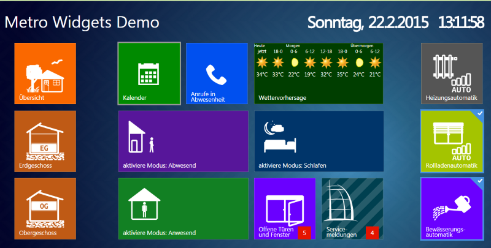

# ioBroker-vis.splitsys!
[Logo](admin/splitsys.png)

============
splitsys - Switch to conditioner

## Changelog

### 1.0.0 (2016-04-07)
- (bluefox) fix button Giva Labs iButton (other widgets did not work)

### 0.0.3 (2015-10-04)
- (bluefox) add version output

### 0.0.2 (2015-10-04)
- (bluefox) fix dependencies

### 0.0.1 (2015-10-04)
- (bluefox) initial checkin

## License
 Copyright (c) 2013-2016 hobbyquaker https://github.com/hobbyquaker, bluefox https://github.com/GermanBluefox
 Apache 2.0 
